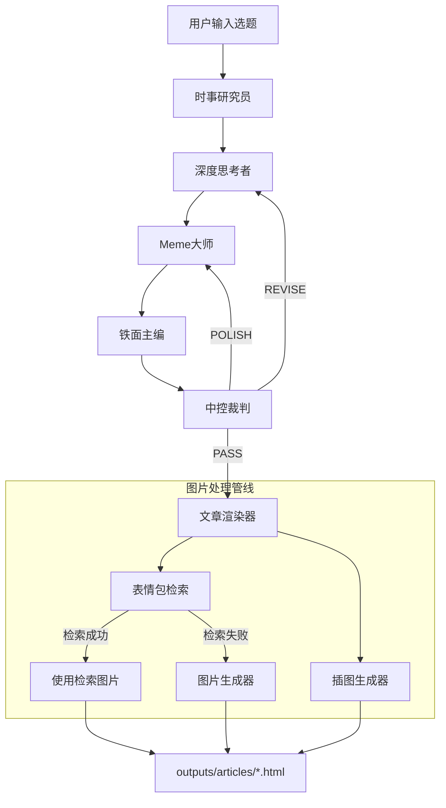

# 三智能体工作流控制 (TriAgent Workflow) v2.1

这是一个工作流编排技能，用于协调时事研究员、深度思考者、Meme大师、铁面主编、中控裁判、文章渲染器的执行顺序和辩论流程。

> **v2.1 更新**：集成了完整的图片处理管线，包括表情包检索、表情包生成、插图生成。

## 触发条件

当用户请求以下任务时使用此技能：
- "写一篇关于xxx的公众号文章"
- "用三智能体模式生成内容"
- "启动辩论工作流"

## 工作流架构 (v2.0)



### 智能体职责一览

| 智能体 | 技能路径 | 职责 |
|--------|----------|------|
| 时事研究员 | `news-researcher` | 搜索相关时事资讯 |
| 深度思考者 | `deep-thinker` | 撰写深度草稿 |
| Meme大师 | `meme-master` | 网感注入、表情包标记 |
| 铁面主编 | `chief-editor` | 融合定稿 |
| 中控裁判 | `central-judge` | 质量评估、决策 |
| 文章渲染器 | `article-renderer` | HTML渲染、图片处理 |
| 表情包检索器 | `meme-retriever` | CLIP语义检索表情包 |
| 图片生成器 | `image-generator` | Gemini生成表情包 |
| 插图生成器 | `illustration-generator` | Gemini生成插图 |

## 执行流程

### 阶段 0：初始化工作流

收到用户选题后：

```markdown
## 🚀 工作流启动

**选题**: [用户的选题]
**工作流版本**: v2.0
**当前轮次**: 1
**最大轮次**: 3

---

### 阶段 1/6: 调用时事研究员

正在搜索与选题相关的最新资讯...

---

现在调用 `news-researcher` 技能，请搜索与选题相关的时事资讯。
```

### 阶段 1：时事研究员

调用 `news-researcher` 技能，输出格式：

```markdown
[NEWS_CONTEXT]
### 1. 新闻标题
- 来源: xxx
- 时间: xxx  
- 摘要: xxx
...
[/NEWS_CONTEXT]

[WORKFLOW_NEXT: deep-thinker]
```

### 阶段 2：深度思考者

将时事研究员的输出传递给深度思考者：

```markdown
## 阶段 2/6: 调用深度思考者

**来源**: news-researcher
**目标**: deep-thinker
**当前轮次**: [x]

---

### 时事资讯背景

[NEWS_CONTEXT]
...
[/NEWS_CONTEXT]

---

现在调用 `deep-thinker` 技能，请基于以上时事资讯撰写深度草稿。
```

### 阶段 3：Meme大师

传递深度草稿给Meme大师：

```markdown
## 阶段 3/6: 调用Meme大师

**来源**: deep-thinker
**目标**: meme-master
**当前轮次**: [x]

---

### 深度草稿

[深度思考者的输出]

---

现在调用 `meme-master` 技能，请进行网感注入和表情包标记。
```

### 阶段 4：铁面主编

传递Meme大师的输出给铁面主编：

```markdown
## 阶段 4/6: 调用铁面主编

**来源**: meme-master
**目标**: chief-editor
**当前轮次**: [x]

---

### Meme大师改写版

[Meme大师的输出]

---

现在调用 `chief-editor` 技能，请进行最终融合定稿。
```

### 阶段 5：中控裁判

传递定稿给中控裁判评估：

```markdown
## 阶段 5/6: 调用中控裁判

**来源**: chief-editor
**目标**: central-judge
**当前轮次**: [x]

---

### 铁面主编定稿

[铁面主编的输出]

---

现在调用 `central-judge` 技能，请评估定稿质量并做出决策。
```

### 阶段 6：根据裁判决策执行

#### 决策 A: PASS → 渲染输出

```markdown
## 阶段 6/6: 调用文章渲染器

**裁判决策**: PASS
**质量评分**: [x.x/10]

---

### 最终定稿

[定稿内容]

---

现在调用 `article-renderer` 技能，请将定稿渲染为HTML文章。
```

#### 决策 B: REVISE → 返回深度思考者

```markdown
## 返回修订 (轮次 x → x+1)

**裁判决策**: REVISE
**问题**: 深度不足
**修订要求**: [具体修订建议]

---

### 当前版本

[当前定稿]

### 修订建议

[裁判的具体建议]

---

现在调用 `deep-thinker` 技能，请根据以上建议增强文章深度。
注意：这是修订轮次，请重点解决深度问题，保留原有亮点。
```

#### 决策 C: POLISH → 返回Meme大师

```markdown
## 返回润色 (轮次 x → x+1)

**裁判决策**: POLISH
**问题**: 网感不足
**润色要求**: [具体润色建议]

---

### 当前版本

[当前定稿]

### 润色建议

[裁判的具体建议]

---

现在调用 `meme-master` 技能，请根据以上建议增强网感。
注意：这是润色轮次，请重点增加趣味性和表情包，保留深度内容。
```

## 工作流状态追踪

在整个流程中，维护以下状态：

```
[WORKFLOW_VERSION: 2.0]
[WORKFLOW_ID: uuid]
[CURRENT_ROUND: x]
[MAX_ROUNDS: 3]
[CURRENT_PHASE: 1-6]
[CURRENT_AGENT: xxx]
[STATUS: RUNNING/COMPLETED/FAILED]
[SCORE_HISTORY: [轮次1评分, 轮次2评分, ...]]
```

## 辩论控制规则

1. **最大轮次限制**：默认最多 3 轮，避免无限循环
2. **强制终止**：如果达到最大轮次仍未 PASS，强制渲染输出
3. **轮次计数**：每次从深度思考者开始算新一轮
4. **跳过时事**：修订/润色轮次不重新搜索时事（除非主题改变）

## 修订/润色轮次的特殊处理

### 修订轮次 (REVISE)

```
用户选题 → [跳过] → 深度思考者(修订) → Meme大师 → 铁面主编 → 中控裁判 → ...
```

- 不重新调用时事研究员
- 深度思考者接收修订建议和当前版本
- 后续流程正常执行

### 润色轮次 (POLISH)

```
用户选题 → [跳过] → [跳过] → Meme大师(润色) → 铁面主编 → 中控裁判 → ...
```

- 不调用时事研究员和深度思考者
- Meme大师接收润色建议和当前版本
- 后续流程正常执行

## 完整示例

用户输入：`写一篇关于 MCP 协议的公众号文章`

```markdown
## 🚀 工作流启动

**选题**: MCP 协议深度解析
**工作流版本**: v2.0
**当前轮次**: 1
**最大轮次**: 3

---

### 阶段 1/6: 调用时事研究员

[使用 WebSearch 搜索相关时事...]

[NEWS_CONTEXT]
### 1. Anthropic 推出 MCP 协议，AI 应用互联新标准
- 来源: 机器之心
- 时间: 2024-11-25
- 摘要: MCP 实现 AI 与外部数据源的标准化连接...
[/NEWS_CONTEXT]

[WORKFLOW_NEXT: deep-thinker]

---

### 阶段 2/6: 调用深度思考者

[深度思考者基于时事资讯撰写草稿...]

[WORKFLOW_NEXT: meme-master]

---

### 阶段 3/6: 调用Meme大师

[Meme大师注入网感和表情包标记...]

[WORKFLOW_NEXT: chief-editor]

---

### 阶段 4/6: 调用铁面主编

[铁面主编融合定稿...]

[WORKFLOW_NEXT: central-judge]

---

### 阶段 5/6: 调用中控裁判

**评分**: 深度 8.0 | 网感 7.5 | 结构 8.0 | 原创 7.0
**总分**: 7.65/10

[JUDGE_DECISION: PASS]
[WORKFLOW_NEXT: article-renderer]

---

### 阶段 6/6: 调用文章渲染器

[渲染 HTML 文章...]
[解析 3 个表情包标记, 1 个配图标记...]

**输出文件**: outputs/articles/20240318_mcp_protocol.html

---

## ✅ 工作流完成

**总轮次**: 1
**最终评分**: 7.65/10
**输出文件**: `outputs/articles/20240318_mcp_protocol.html`

[WORKFLOW_STATUS: COMPLETED]
```

## 错误处理

### 智能体调用失败

```markdown
## ⚠️ 工作流异常

**失败阶段**: [阶段名称]
**错误类型**: [错误描述]
**建议操作**: [重试/跳过/终止]

[WORKFLOW_STATUS: ERROR]
[ERROR_PHASE: xxx]
[ERROR_MSG: xxx]
```

### 达到最大轮次

```markdown
## ⏰ 达到最大轮次

**当前轮次**: 3 (已达上限)
**最终评分**: 6.5/10
**裁判备注**: 仍有提升空间，建议人工优化

强制进入渲染阶段...

[WORKFLOW_NEXT: article-renderer]
[FORCED_PASS: true]
```
