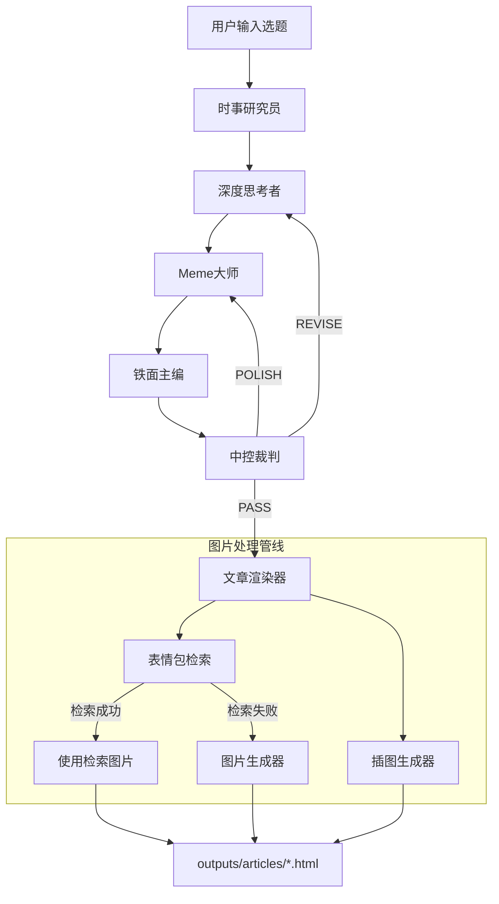

# Multi-Agent Article Generation System

> 多智能体公众号文章生成系统 - 跨平台智能体定义

## 概述

本项目实现了一个基于多智能体辩论机制的微信公众号文章生成系统。通过多个 AI 智能体的协作与博弈，生成兼具深度与网感的高质量图文内容。

## 智能体架构



## 智能体列表

| 智能体 | 目录 | 职责 | 推荐模型 |
|--------|------|------|----------|
| 时事研究员 | `agents/news-researcher/` | 搜索相关时事资讯 | GPT-4 / Claude |
| 深度思考者 | `agents/deep-thinker/` | 撰写深度草稿 | DeepSeek |
| Meme大师 | `agents/meme-master/` | 网感注入、表情包标记 | GPT-4o / Claude |
| 铁面主编 | `agents/chief-editor/` | 融合定稿 | Gemini / Claude |
| 中控裁判 | `agents/central-judge/` | 质量评估、决策 | GPT-4 / Claude |
| 文章渲染器 | `agents/article-renderer/` | HTML渲染、图片处理 | Any |
| 表情包检索器 | `agents/meme-retriever/` | CLIP语义检索表情包 | 本地 CLIP 模型 |
| 图片生成器 | `agents/image-generator/` | 生成表情包 | Gemini |
| 插图生成器 | `agents/illustration-generator/` | 生成文章插图 | Gemini |
| 文章评估者 | `agents/article-evaluator/` | 质量评分 | GPT-4 / Claude |

## 工作流

主工作流定义在 `agents/triagent-workflow/AGENT.md`，支持：

- **多轮辩论**：最多 3 轮修订/润色
- **智能决策**：中控裁判根据评分决定继续或通过
- **图片处理**：自动检索或生成表情包和插图
- **HTML 输出**：生成微信公众号风格的 HTML 文章

## 使用方法

### 触发工作流

对 AI 助手说以下任意一种：

- "写一篇关于 [主题] 的公众号文章"
- "用三智能体模式生成内容"
- "启动辩论工作流"

### 调用单个智能体

直接引用智能体定义文件：

- `@agents/deep-thinker/AGENT.md` - 深度分析
- `@agents/meme-master/AGENT.md` - 网感化改写
- `@agents/news-researcher/AGENT.md` - 时事搜索

## 平台适配

本项目支持多种 AI 编程平台：

| 平台 | 配置文件位置 | 说明 |
|------|--------------|------|
| Cursor | `.cursor/skills/` 或 `.cursor/rules/` | 推荐使用 skills |
| Claude Code | `CLAUDE.md` | 项目根目录 |
| GitHub Copilot | `.github/copilot-instructions.md` | |
| Windsurf | `.windsurfrules` | |
| Aider | `.aider.conf.yml` | |
| 通用 | `AGENTS.md` + `agents/` | 本文件 |

详见 `docs/PLATFORM_GUIDE.md` 获取详细配置说明。

## 目录结构

```
agents/
├── triagent-workflow/    # 主工作流控制
│   └── AGENT.md
├── news-researcher/      # 时事研究员
│   └── AGENT.md
├── deep-thinker/         # 深度思考者
│   └── AGENT.md
├── meme-master/          # Meme大师
│   └── AGENT.md
├── chief-editor/         # 铁面主编
│   └── AGENT.md
├── central-judge/        # 中控裁判
│   └── AGENT.md
├── article-renderer/     # 文章渲染器
│   └── AGENT.md
├── meme-retriever/       # 表情包检索
│   └── AGENT.md
├── image-generator/      # 图片生成
│   └── AGENT.md
├── illustration-generator/  # 插图生成
│   └── AGENT.md
└── article-evaluator/    # 文章评估
    └── AGENT.md
```

## 快速开始

1. **配置 API Keys**
   ```bash
   cp config/gemini.example.json config/gemini.json
   # 编辑 config/gemini.json 填入你的 API Key
   ```

2. **安装依赖**
   ```bash
   pip install -r requirements.txt
   ```

3. **构建表情包索引**（可选）
   ```bash
   python scripts/download_hf_memes.py
   ```

4. **使用工作流**
   - 在你的 AI 编程工具中打开项目
   - 触发三智能体工作流
   - 输入选题开始生成

## 贡献

欢迎提交 PR 添加新的智能体或优化现有工作流！

## License

MIT
