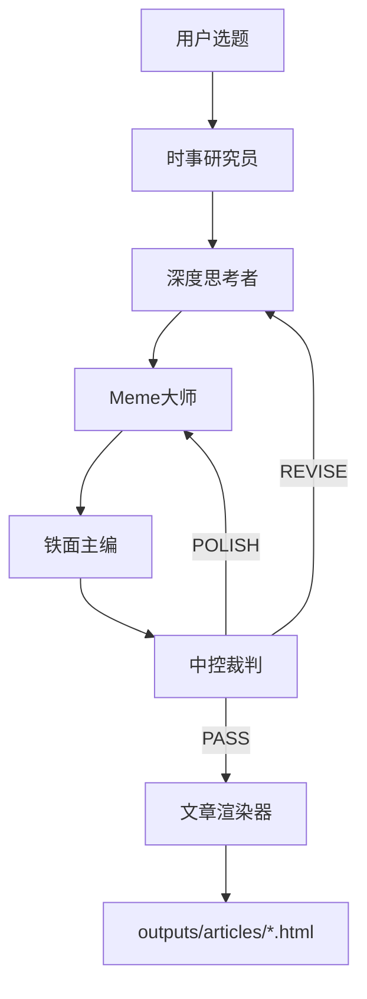

# 基于多模态大模型的微信公众号图文内容生成与表情包智能适配研究

## 项目简介

本项目为毕业设计，研究如何利用多智能体辩论机制和多模态大模型，生成具有深度和网感的微信公众号文章，并实现表情包的智能适配。

## 核心创新

**多智能体辩论架构 (Tri-Agent Debate) v2.0**：通过六个不同角色的 AI 智能体协作，打破单一模型输出"平庸正确"的局限。



### 六大智能体

| 智能体 | 角色定位 | 核心任务 |
|--------|----------|----------|
| **时事研究员** | 资讯搜集者 | 搜索相关时事，提供背景素材 |
| **深度思考者** | 学术派、老教授 | 深度(Depth)、保真度(Fidelity) |
| **Meme大师** | 00后、网感达人 | 传播性(Virality)、情感共鸣(Empathy) |
| **铁面主编** | 排版专家 | 仲裁(Arbitration)、图文对齐(Visual Alignment) |
| **中控裁判** | 质量把控者 | 评分决策、迭代控制 |
| **文章渲染器** | 输出工程师 | HTML渲染、图片处理 |

## 多平台支持

本项目支持多种 AI 编程平台，智能体定义可被自动识别：

| 平台 | 配置文件 | 状态 |
|------|----------|------|
| **Cursor** | `.cursor/skills/` + `.cursor/rules/` | ✅ 推荐 |
| **Claude Code** | `CLAUDE.md` | ✅ 支持 |
| **GitHub Copilot** | `.github/copilot-instructions.md` | ✅ 支持 |
| **Windsurf** | `.windsurfrules` | ✅ 支持 |
| **Aider** | `.aider.conf.yml` | ✅ 支持 |
| **通用** | `AGENTS.md` + `agents/` | ✅ 通用 |

### 一键配置

```bash
# 配置所有平台
./scripts/setup_platform.sh all

# 配置特定平台
./scripts/setup_platform.sh cursor
./scripts/setup_platform.sh claude
```

详细使用说明见 [`docs/PLATFORM_GUIDE.md`](docs/PLATFORM_GUIDE.md)

## 项目结构

```
.
├── agents/                      # 通用智能体定义（跨平台）
│   ├── */AGENT.md               # 各智能体定义
├── .cursor/skills/              # Cursor Skills（核心）
│   ├── news-researcher/         # 时事研究员技能
│   ├── deep-thinker/            # 深度思考者技能
│   ├── meme-master/             # Meme大师技能
│   ├── chief-editor/            # 铁面主编技能
│   ├── central-judge/           # 中控裁判技能
│   ├── article-renderer/        # 文章渲染器技能
│   ├── meme-retriever/          # 表情包检索技能 [v2.1新增]
│   ├── image-generator/         # 图片生成技能 [v2.1新增]
│   ├── illustration-generator/  # 插图生成技能 [v2.1新增]
│   ├── triagent-workflow/       # 工作流编排技能 [v2.1]
│   └── article-evaluator/       # 文章评估技能
├── scripts/                     # 工具脚本
│   ├── meme_retrieval.py        # 表情包 CLIP 检索
│   ├── generate_image.py        # Gemini 图片生成 [v2.1新增]
│   ├── render_article.py        # 文章渲染脚本 [v2.1新增]
│   ├── build_meme_index.py      # CLIP 向量索引构建
│   ├── crawl_memes.py           # 表情包爬虫
│   └── download_hf_memes.py     # HuggingFace 数据集下载
├── config/                      # 配置文件 [v2.1新增]
│   └── gemini.json              # Gemini API 配置
├── memes/                       # 表情包数据
│   ├── images/                  # 表情包图片
│   ├── tags.json                # 标签索引
│   └── embeddings.npy           # CLIP 向量
├── outputs/                     # 输出目录
│   ├── articles/                # HTML 文章输出
│   │   └── template.html        # HTML 模板
│   └── images/                  # 生成的图片 [v2.1新增]
│       ├── memes/               # 生成的表情包
│       └── illustrations/       # 生成的插图
├── AGENTS.md                    # 通用智能体说明
├── CLAUDE.md                    # Claude Code 配置
├── .windsurfrules               # Windsurf 配置
├── .aider.conf.yml              # Aider 配置
├── .github/
│   └── copilot-instructions.md  # GitHub Copilot 配置
├── docs/
│   └── PLATFORM_GUIDE.md        # 多平台使用指南
├── 毕业设计任务书.md
└── 开题报告.md
```

## 快速开始

### 1. 使用 Cursor Skills

本项目的核心功能通过 Cursor Skills 实现。在 Cursor 中：

```
# 生成一篇公众号文章（完整工作流）
请使用三智能体工作流，写一篇关于 [主题] 的公众号文章

# 或分步调用
请以时事研究员的身份，搜索关于 [主题] 的最新资讯
请以深度思考者的身份，分析 [主题]
```

### 2. 准备表情包数据

```bash
# 安装依赖
pip install -r scripts/requirements.txt

# 方式 1：从 HuggingFace 下载数据集（推荐）
python scripts/download_hf_memes.py

# 方式 2：爬取表情包
python scripts/crawl_memes.py

# 构建 CLIP 向量索引
python scripts/build_meme_index.py
```

### 3. 工作流说明

**v2.0 新流程**：

1. **时事研究**：WebSearch 搜索相关资讯
2. **深度撰写**：基于时事撰写深度草稿
3. **网感注入**：添加表情包和趣味表达
4. **融合定稿**：平衡深度与趣味
5. **质量评估**：中控裁判打分决策
6. **迭代/渲染**：不合格则返工，合格则输出 HTML

**评分机制**：
- 总分 >= 7.5 → 通过，进入渲染
- 深度分 < 6 → 返回深度思考者修订
- 网感分 < 6 → 返回 Meme 大师润色
- 轮次 >= 3 → 强制通过

## 技术栈

- **文本生成**: DeepSeek (深度), GPT-4o/Claude (网感)
- **图文对齐**: Gemini (主编 + 生图)
- **跨模态检索**: CLIP (ViT-B-32, 表情包语义匹配)
- **图片生成**: Gemini 2.0 Flash (表情包 + 插图)
- **时事搜索**: WebSearch 工具
- **工作流编排**: Cursor Skills
- **输出格式**: HTML (微信公众号风格)

## 图片处理管线 (v2.1)

```
[MEME: tag] → CLIP检索 → 相似度>=0.25? → 是 → 使用检索图片
                                      → 否 → Gemini生成表情包

[IMG: desc] → 直接调用 Gemini 生成插图
```

配置 Gemini API (`config/gemini.json`):
```json
{
  "api_key": "YOUR_API_KEY",
  "base_url": "https://generativelanguage.googleapis.com/v1",
  "model": "gemini-2.0-flash-exp-image-generation"
}
```

## 学术参考

详见 `开题报告.md` 中的参考文献，主要涉及：
- Multi-Agent Debate (多智能体辩论)
- Visual Storytelling (视觉叙事)
- Cross-Modal Retrieval (跨模态检索)
- Meme Understanding & Generation (表情包理解与生成)

## 评价指标

- **CLIP Score**: 图文语义对齐度
- **深度分**: 逻辑结构、数据支撑、深度分析
- **网感分**: 语言趣味、情感共鸣、表情包适配
- **结构分**: 段落划分、图文位置、节奏流畅
- **原创分**: 观点新颖、个人风格

## 许可

本项目仅用于学术研究和毕业设计。
# wechat-article-generator
